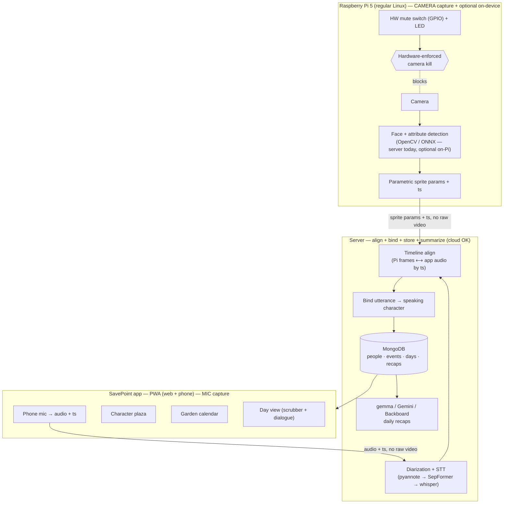

# SavePoint — Design Document

> *"Your life autosaves."*
>
> A Raspberry Pi 5 wearable turns the people you talk to into pixel characters, and a
> companion app is a cozy, Stardew-Valley-style journal of your day. **Game first**;
> memory-aid is an honest secondary benefit, not a medical claim.

Status: living design doc · Hack the 6ix 2026 · Team **Savepoint**

---

## 1. Overview

SavePoint captures the **people and moments of your real day** with an on-device
camera + microphone, and replays them back to you as a calm, structured, cozy game
world. Each person you talk to becomes a **pixel character**; each day becomes a
**plant in a garden**; each conversation becomes a set of **video-game dialogue
boxes** you can revisit.

The intelligence that matters — detecting faces and separating who-said-what — turns
raw capture into **derived data** (sprite parameters, transcript text), never stored
photos. It runs **server-side today** and can *optionally* move on-device on the Pi 5.
Either way, raw faces don't need to leave your control — that's both the privacy story
and the technical centerpiece.

---

## 2. Problem & positioning

- **Game-first.** It's a delightful, low-pressure "journal of your life" — the primary
  hook is charm (Stardew / Tomodachi Life / Mii-channel energy), not therapy.
- **Memory-aid as an honest secondary.** The structured, low-stimulation recap helps
  anyone who wants to remember "who did I talk to and what about" — gently useful for
  memory/sensory load, **without** making a clinical/therapeutic claim (so: no
  medical-validation or vulnerable-user-consent burden).
- **Privacy-first by construction.** Raw faces never leave the device; people become
  **abstract sprites, not stored photos**.

### Target users
Primary: anyone who wants a warm, effortless record of their social day. Soft
secondary: people who find real-time social reality noisy or hard to retain.

---

## 3. The demo moment (build backward from this)

> A judge walks up and talks to the wearer. The Pi's frame + audio hit **`POST /ingest`**
> and within a few seconds they appear on screen as a **Stardew / Mii-style character**
> (a deterministic sprite from their face attributes). Their words attach to **their**
> character (diarized who-said-what). It lands in **"Today"** with an **Undertale-style**
> dialogue recap and a one-line LLM summary. *Optional flourish:* toggle the **hardware
> mute** and capture visibly stops. If live binding wobbles on stage, **tap-to-assign**
> keeps the demo clean.

**Numbers to hit:** face-in-frame → sprite ≤ 3s; audio/video clock skew < ~150ms (only
relevant if audio stays off-device — see §6).

---

## 4. System architecture

Two clean tiers. The **edge tier** (Pi 5) captures IO and can *optionally* run inference
on-device; the **app/cloud tier** does the binding, storage, and non-real-time storytelling.

The **camera lives on the Pi**; the **microphone lives on the app/phone**. They are two
independent, unsynchronised sources — the **server aligns them by timestamp** (see §6).



**Key boundaries**
- **Two independent capture sources:** the **Pi camera** and the **app/phone mic** run on
  separate clocks; the **server aligns them by timestamp** to bind who-spoke to who-was-seen.
- **Only derived data leaves each device:** sprite parameters + timestamps from the Pi,
  audio + timestamps from the app — not raw photos or video.
- Inference (face detect + diarization) runs **server-side today**; face detect can
  *optionally* move on-device on the Pi for a stronger privacy + hardware story.
- The **hardware mute** on the Pi physically cuts the **camera** (LED shows state); the app
  controls its own mic capture. Consent-friendly and demoable.

---

## 5. Hardware

| Part | Choice | Notes |
|---|---|---|
| Compute | **Raspberry Pi 5** | Runs a **regular Raspberry Pi OS (Linux)** image; official BCM2712 support. |
| OS | **Raspberry Pi OS (Linux)** | Regular image — **no QNX / RTOS.** |
| Camera | Pi Camera Module 3 (22-pin) | Same connector as Pi Zero 2 W. |
| Mic | **On the app/phone, not the Pi** | Audio is captured app-side; the server timeline-aligns it with the Pi camera (see §6). Both devices should share a clock (NTP) so timestamps line up. |
| Privacy | **GPIO push-button + LED** | Hardware mute cuts capture; LED shows recording state. |
| AI runtime *(optional)* | ONNX Runtime / OpenCV on the Pi | Only for the optional on-device inference path; not required for the core loop. |

---

## 6. Speech / AI pipeline (who-said-what)

**Locked decision:** the project uses **jiucheng's diarization pipeline** (vendored in
`pipeline/`, validated on real 2-speaker audio + ground-truth `tc1–tc5`). It is a
*blind-diarization* pipeline — it separates who-said-what without prior enrollment:

1. **Diarization**: **pyannote Community-1** segments the audio into speaker turns
   (~95% accuracy on `tc1`).
2. **Overlap split**: **SepFormer** separates overlapping speech so crosstalk is
   attributed correctly.
3. **STT**: **faster-whisper** transcribes each segment.
4. **Merge** → a clean `Speaker N: text` transcript, one entry per utterance.

The server stores each utterance as a **SPOKE `Event`** with a `Speaker N` label
(`personId`). Speech runs behind a **`Transcriber` protocol**: `StubTranscriber` (a `tc1`
fixture — the CI default, no torch) and `RealTranscriber` (the vendored pipeline via a
subprocess, needs `HF_TOKEN`; `SAVEPOINT_TRANSCRIBER=real`).

> **Two-source timeline alignment.** Audio comes from the **app/phone mic**, video from the
> **Pi camera** — two independent clocks. The server **aligns them by timestamp**: an
> utterance at time *t* is bound to whoever the camera saw around *t*. This needs
> comparable clocks (NTP) on both devices. It also implies the ingest path will likely
> **decouple** into a Pi frame-stream + an app audio-stream landing separately (rather than
> today's single frame+audio `/ingest` call), joined server-side by overlapping `ts`.

> **Identity binding is a separate seam.** Blind diarization gives *anonymous* `Speaker N`
> labels; tying a speaker to the *right* Person sprite (so a line attaches to the correct
> character) is still an open mechanic — options: active-speaker (person in frame = current
> speaker), voice-embedding match to a known Person, or tap-to-assign. Tracked as an open
> decision (§15). The old ECAPA voice-enrollment + `/label` prototype is **shelved** — this
> diarization pipeline replaced it.

### Accuracy tooling
`pipeline/score.py` (a stdlib-only, CI-safe scorer — SAV-38): scores predicted segments
vs a ground-truth testcase → **speaker-attribution accuracy + WER + speaker-count**. No
torch, so it runs in CI; feed it the real pipeline's output to regression-test changes.

---

## 7. Character generation

**Parametric sprite assembly**, *not* generative art. From the detected face, extract a
few stable attributes — **skin tone, hair color, hair style, glasses, hat, shirt
color** — and compose a Stardew-style sprite from a layered kit.

- **Deterministic:** the same person always maps to the same sprite (essential for
  "recognize your recurring townsfolk").
- **Fast + offline:** no diffusion, no network — runs server-side today, and can run
  on-device on the Pi.
- Story: *"we read your face, we don't paint it."*

The backend already emits the **6 avatar axes** per Person (`avatarParams`): `skinTone`,
`hairColor`, `hairStyle`, `glasses`, `hat`, `shirtColor`. The **app-side sprite kit**
(still to build) composes these into a character by stacking **palette-swappable layered
parts** (one body + hair shapes + shirt + accessories, each palette-swapped across the
axis values) — the Mii trick that turns thousands of combinations into a small art set.
Design of the part atlases is being settled with waterprism.

LLMs (gemma/Gemini/Backboard) may write a character's **bio/flavor text**, never render pixels.

---

## 8. Privacy model

- **On-device by default.** Raw camera frames are processed on the Pi and discarded;
  only derived data (sprite params, embeddings, transcript text) leaves.
- **Sprites, not photos.** People are stored as abstract avatars. An optional "IRL photo"
  is **opt-in and on-device only** — do not sync raw faces to the server (this keeps the
  privacy story intact).
- **Hardware mute.** A physical switch guarantees no capture when muted; a visible LED
  shows recording state. Consent-friendly and demoable.
- For any live demo: only record consenting teammates; frame it as a prototype.

---

## 9. Data model (MongoDB Atlas)

```
people   { _id, localId, name?, avatarParams, voiceEmbedding?, tags[], favorite,
           firstSeen, lastSeen, notes }
events   { _id, ts, personId, type: "seen" | "spoke", text?, emotion?, place?, dayId }
days     { _id, date, moodColor?, journalNotes?, plantStage, plantType? }
recaps   { _id, date, scope: "day" | "month" | "year", narrative, highlights[] }
```

**Flow:** Pi emits an event → server upserts `people` (match by nearest face/voice
embedding, else new `localId`) → append `events` → the day's **recap** is generated on
demand (`POST /day/{date}/recap`, live on gemma). Store derived data only; keep embeddings
on-device where feasible.

**Notes (current implementation):**
- `events.personId` currently holds the diarized **`Speaker N`** label, not yet a resolved
  Person `localId` — see the identity-binding seam in §6.
- `plantStage` is computed from a day's activity (SAV-54) and now seeds an **auto-suggested
  plant**; the garden plant is ultimately **user-chosen** (`plantType`, per the frontend
  redesign) with that suggestion as the default.
- `recaps` are read via `GET /day/{date}` (composed) and (re)generated via
  `POST /day/{date}/recap`.

---

## 10. Application (SavePoint app) — UI/UX

A **portrait mobile app** (built as a **PWA** so web + phone share one codebase), cozy
pixel / Stardew aesthetic.

> **Redesign in progress (waterprism, 2026-07-18).** The app is moving to a fuller
> game-world feel — a living **character plaza**, a **garden calendar**, and a
> **cinematic Day view**. The layout below reflects that direction; it maps ~1:1 onto the
> read API and is still being iterated (assets/fonts/colors not final).

### 10.1 Main page — one continuous world, swipe left/right
The two pages sit in **one horizontally-pannable space** (swipe between them, not tabs):
- **Character plaza.** Everyone you've met appears as a pixel character that **idle-wanders
  and does light activities / interacts** with others — a living town, not a static row. A
  **whistle** control calls them into a tidy line vs. free roam. **Tapping a character**
  surfaces contextual **notifications** for that person: *"haven't seen them in a while
  👋"* (from `lastSeen`), a **resurfaced memorable line** from a past chat (from event
  `text`), or a mini-cutscene — and opens their profile.
  - **Empty / day-one state:** a lovely little companion sprite + *"go say hi to someone 🌱"*.
- **Calendar (garden).** A grid of **plant tiles, one per day** (today highlighted). The
  plant is **user-chosen** to represent the day, with an **auto-suggested** default derived
  from that day's activity (`plantStage`). Tap a plant → **Day view**; months of history
  scroll/pan.

**Top nav:** app logo/name + settings. **Bottom nav:** left = **People log**, big center =
**Today** (→ Day view, the daily core loop), right = **Journal/edit** (notes + a mood
picker). A floating **whistle** button drives the plaza's line/roam toggle.

### 10.2 Dialogue — Undertale style (shared component)
Used by both the character-tap and the Day-view playback:
- **User avatar on the LEFT, the other person on the RIGHT**, textbox below.
- **Typewriter** text (~34ms/char), blinking ▼ when a line finishes.
- The **speaking** avatar is opaque/raised; the **non-speaking** one is dimmed +
  grayscale.
- **Click anywhere to advance** (first click completes the current line, next advances,
  last closes). Day-view **◀ / ▶** buttons and timeline **flag taps** drive the same engine.

### 10.3 People log
Contact-list of everyone met: avatar, last-seen, tags, favorite ⭐. **Filter chips:**
All / Recents / Frequent / Favorites (and tags). Tap a person → Person info.

### 10.4 Person info
Large avatar (tap to **flip** to an optional on-device photo placeholder), summary/notes,
and a **recent-interactions log** — each row taps through to the Day view.

### 10.5 Day view (one reusable component) — cinematic replay
Reachable from the center nav, any calendar plant, and person-info rows. Plays the day
back as a **cutscene**: a **cinematic letterbox** (the black bars) frames the scene, and
the user's character can **walk into different backdrops / "rooms"** to change scenes. The
people present that day stand in the scene; a Stardew **dialogue box** shows each utterance
(`text` + speaker portrait). A **bottom timeline scrubber** (e.g. 8:00AM → 10:30PM, a stone
slider) scrubs through the day — the present characters + active dialogue line update to
that moment (backed by event `ts`). A **top-right icon toggles the transcript history**
(the raw diarized event list). Empty days show a graceful "quiet day" state.

---

## 11. Recaps & summaries
Recaps and character bios go through **one pluggable LLM interface** (`LLMClient` in
`services/llm.py`; `get_llm_client` picks the backend from the `recap_backend` config).
**Shipped and live on gemma** (M3): `POST /day/{date}/recap` turns a day's events into a
cozy Stardew-toned `narrative` + 2–4 `highlights`, stored on the Day. Swapping backends is
one config value:
- **gemma** (self-hosted, **current default** — verified end-to-end).
- **Gemini** — natural-language daily recap + "who did I meet / what did we talk about?" Q&A.
- **Backboard** — multi-model orchestration for character bios + day/month recaps.
- **FreeSolo** — a **fine-tuned** cozy-recap LoRA via their Flash service. Spike (SAV-51)
  found Flash is fine-tuning-only (no drop-in base-model API); jiucheng is training an
  adapter → integrate when deployed (SAV-52). Needs its own client variant (trained
  adapters reject the `enable_thinking` kwarg gemma requires).
- **ElevenLabs** — voice the dialogue playback and/or narrate the daily recap.
- Month/year rollups: garden summaries (mock for the demo).

---

## 12. Prize strategy

**No single "primary" anymore — weight by demo impact.**

| Track | How we hit it |
|---|---|
| **FreeSolo** | A **fine-tuned** cozy-recap LoRA via their **Flash** service (spike SAV-51: fine-tuning-only, not a drop-in API). Adapter training underway → integrate on deploy (SAV-52). |
| **Backboard** | Multi-model orchestration for character bios + day/month recaps. |
| **ElevenLabs** | Voice the Undertale-style dialogue playback and/or narrate the daily recap. |
| **MongoDB** | Character roster, event log, day/month aggregates — already the backbone. |
| **Gemini** | Daily recap + conversational Q&A over the day. |
| **Best Hardware** | The Pi 5 device: camera/mic capture, optional on-device inference, hardware mute + LED. |

Submit to every track legitimately satisfied — each is judged independently.

---

## 13. Tech stack

- **Edge:** Pi 5 on a **regular Raspberry Pi OS (Linux)** image; **camera only** (mic is
  app-side); *optional* on-device OpenCV / ONNX face detect + GPIO mute + LED. **No QNX.**
- **Speech:** vendored diarization → transcription pipeline (`Speaker N: text`), behind a
  `Transcriber` protocol (stub for CI, real pipeline via subprocess).
- **Backend:** **FastAPI + uv** + **MongoDB**; frame+audio ingest Pi→server; recaps via
  the chosen LLM backend (**FreeSolo / Gemini / Backboard**, optional ElevenLabs narration).
- **App:** React 19 + HeroUI v3 + Tailwind v4 + framer-motion **PWA**, cozy pixel,
  Undertale dialogue; parametric sprite kit.

---

## 14. MVP & cut-lines

**Hero flow (never cut):** frame + audio → `POST /ingest` → deterministic character sprite
→ diarized who-said-what → lands in "Today" with a narrated recap.

**Cut in this order if time runs short:**
1. On-device inference / hardware mute → keep capture on the Pi, inference on the server.
2. Month/year garden rollups → static mock.
3. Live audio auto-binding → "person in frame = speaker" / tap-to-assign.
4. Cross-day face re-ID → session-scoped.

**Never cut:** the core game loop — person → character → who-said-what → lands in "Today"
(live today, M1).

---

## 15. Open decisions
1. **Recap/bio LLM backend — settled on gemma for now** (implemented, live). Sub-question:
   invest in the **FreeSolo prize** (adapter training underway) or stay on gemma?
2. **Speaker → Person binding** (§6): active-speaker (in-frame), voice-embedding match, or
   tap-to-assign — how a diarized `Speaker N` line attaches to the right character sprite.
3. **Who builds the redesigned frontend:** waterprism owns design; the dev-agent wires
   `app/` to the live API (a prototype is being stood up) — confirm ownership split.
4. **Cross-device sync (decided):** mic = app/phone, camera = Pi, **server aligns by
   timestamp**. Open: the clock-sync scheme (NTP?) + whether to decouple `/ingest` into
   separate frame/audio streams joined by `ts`.
5. Which screens are the hero screens (proposed: Character plaza + Day view).
6. **How far to push the optional on-device / Pi hardware polish** given remaining time.

---

## 16. Repo layout (proposed)

```
savepoint/
  edge/            # Pi (Raspberry Pi OS): capture, optional on-device inference, mute, event emitter
  server/          # FastAPI + uv + Mongo + recap (FreeSolo/Gemini/Backboard); binding
  app/             # SavePoint PWA (character scene, garden, day view)
  pipeline/        # speech: vendored diarization → transcription
  DESIGN.md
  README.md
```

---

*This document reflects the current shared understanding and is meant to be edited as
the team locks decisions. Everything here is a proposal to argue with.*