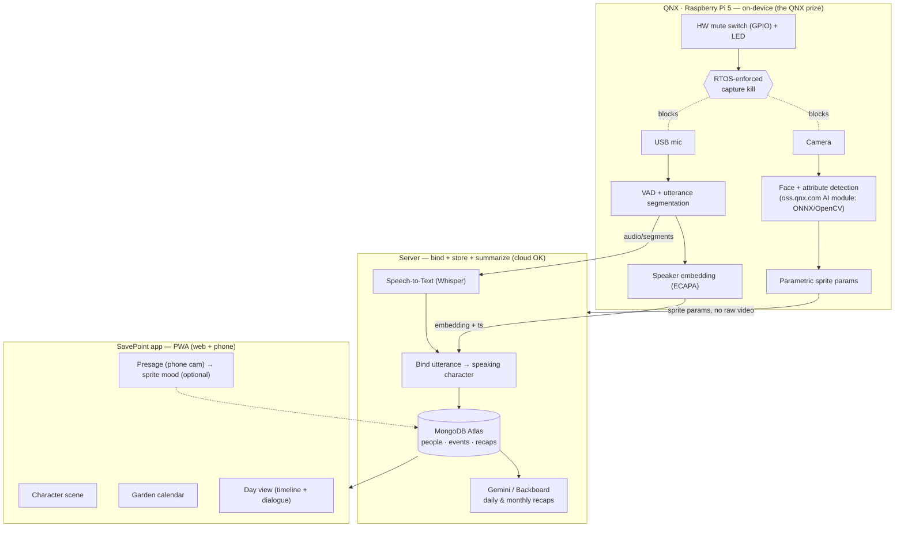

# SavePoint — Design Document

> *"Your life autosaves."*
>
> A QNX-powered wearable turns the people you talk to into pixel characters, and a
> companion app is a cozy, Stardew-Valley-style journal of your day. **Game first**;
> memory-aid is an honest secondary benefit, not a medical claim.

Status: living design doc · Hack the 6ix 2026 · Team **Savepoint**

---

## 1. Overview

SavePoint captures the **people and moments of your real day** with an on-device
camera + microphone, and replays them back to you as a calm, structured, cozy game
world. Each person you talk to becomes a **pixel character**; each day becomes a
**plant in a garden**; each conversation becomes a set of **video-game dialogue
boxes** you can revisit.

The intelligence that matters — detecting faces and separating who-said-what — runs
**on the embedded device (QNX on a Raspberry Pi 5), not in the cloud**. That's both
the privacy story and the technical centerpiece.

---

## 2. Problem & positioning

- **Game-first.** It's a delightful, low-pressure "journal of your life" — the primary
  hook is charm (Stardew / Tomodachi Life / Mii-channel energy), not therapy.
- **Memory-aid as an honest secondary.** The structured, low-stimulation recap helps
  anyone who wants to remember "who did I talk to and what about" — gently useful for
  memory/sensory load, **without** making a clinical/therapeutic claim (so: no
  medical-validation or vulnerable-user-consent burden).
- **Privacy-first by construction.** Raw faces never leave the device; people become
  **abstract sprites, not stored photos**.

### Target users
Primary: anyone who wants a warm, effortless record of their social day. Soft
secondary: people who find real-time social reality noisy or hard to retain.

---

## 3. The demo moment (build backward from this)

> A judge walks up and talks to the wearer. Within ~3s they appear on screen as a
> **Stardew character** (attributes read from their face **on the Pi**). Their words
> attach to **their** character (matched by enrolled voice). It lands in **"Today"**
> with an **Undertale-style** dialogue recap and a one-line Gemini summary. Toggle the
> **hardware mute** and recording visibly stops. **The vision runs on the Pi.** If live
> binding wobbles on stage, **tap-to-assign** keeps the demo clean.

**Numbers to hit:** face-in-frame → sprite ≤ 3s; audio/video clock skew < ~150ms (only
relevant if audio stays off-device — see §6).

---

## 4. System architecture

Two clean tiers. The **edge tier** is real-time, on-device, and "cannot-fail"; the
**app/cloud tier** is non-real-time storytelling.



**Key boundaries**
- **Raw face video never leaves the Pi.** It ships only *derived* data: sprite
  parameters, speaker embeddings, timestamps, transcript text.
- On-device inference = the QNX "runs on the hardware, not cloud" proof **and** the
  privacy guarantee, in one design choice.
- The **hardware mute** physically cuts camera + mic, enforced by the RTOS — it can
  never record when muted. This is the "cannot-fail / real-time" story.

---

## 5. Hardware

| Part | Choice | Notes |
|---|---|---|
| Compute | **Raspberry Pi 5** | Runs **QNX SDP 8.0** (QSTI image); official BCM2712 BSP. |
| OS | **QNX Neutrino RTOS** | Free non-commercial license (qnx.com/getqnx). |
| Camera | Pi Camera Module 3 (22-pin) | Same connector as Pi Zero 2 W. |
| Mic | **USB mic / ReSpeaker** on the Pi | *Recommended* — co-locates audio+video on one clock (see §6). |
| Privacy | **GPIO push-button + LED** | Hardware mute; RTOS cuts capture, LED shows recording state. |
| AI runtime | ONNX Runtime / OpenCV DNN from **oss.qnx.com** | Satisfies the "include an oss.qnx.com AI module" rule. |

---

## 6. Speech / AI pipeline (who-said-what)

Already prototyped and working (see the demo app). Pipeline per utterance:

1. **VAD** (webrtcvad) segments the audio into utterances (flush after ~0.7s trailing
   silence, or 8s max; min ~1s for a reliable embedding).
2. **STT**: `faster-whisper` (base, int8, CPU) → transcript text.
3. **Speaker embedding**: **SpeechBrain ECAPA-TDNN** (`spkrec-ecapa-voxceleb`, 192-d).
4. **Assignment (hybrid):**
   - If speakers are **enrolled**, match the utterance to the nearest enrolled voice by
     cosine similarity (tunable threshold, default ~0.35); below threshold → "Unknown".
   - If nobody is enrolled, fall back to capped **online clustering** (Person A/B…).
5. **Binding to a face:** for the demo, **the person in the camera frame = the speaker**
   (active-speaker assumption). *Stretch:* timestamp-aligned lip/voice-activity binding.
   *Fallback:* **tap-to-assign**.

**Enrollment UX:** "Add me" → record ~5s → store the voiceprint under a name. Then the
timeline shows real names. A live **calibration slider** re-runs assignment over
recorded messages at a new threshold (with a confirm modal).

> Design note: real-time *blind* diarization is inherently unstable (it over-split 2
> speakers into "Person E" in testing). Enrollment + a stable threshold is the robust
> path and matches the product (characters = enrolled people).

### Validation tooling
A **`/label` tool**: upload a video → the pipeline runs offline → you hand-label
who-speaks-when → it scores predicted-vs-ground-truth (Hungarian-mapped speaker
attribution accuracy) and exports JSON fixtures.

---

## 7. Character generation

**Parametric sprite assembly**, *not* generative art. From the detected face, extract a
few stable attributes — **skin tone, hair color, hair style, glasses, hat, shirt
color** — and compose a Stardew-style sprite from a layered kit.

- **Deterministic:** the same person always maps to the same sprite (essential for
  "recognize your recurring townsfolk").
- **Fast + offline:** no diffusion, no network, runs on-device.
- Story: *"we read your face, we don't paint it."*

LLMs (Gemini/Backboard) may write a character's **bio/flavor text**, never render pixels.

---

## 8. Privacy model

- **On-device by default.** Raw camera frames are processed on the Pi and discarded;
  only derived data (sprite params, embeddings, transcript text) leaves.
- **Sprites, not photos.** People are stored as abstract avatars. An optional "IRL photo"
  is **opt-in and on-device only** — do not sync raw faces to the server (this keeps the
  privacy + QNX story intact).
- **Hardware mute.** A physical switch guarantees no capture when muted; a visible LED
  shows recording state. Consent-friendly and demoable.
- For any live demo: only record consenting teammates; frame it as a prototype.

---

## 9. Data model (MongoDB Atlas)

```
people   { _id, localId, name?, avatarParams, voiceEmbedding?, tags[], favorite,
           firstSeen, lastSeen, notes }
events   { _id, ts, personId, type: "seen" | "spoke", text?, emotion?, place?, dayId }
days     { _id, date, moodColor?, journalNotes?, plantStage }
recaps   { _id, date, scope: "day" | "month" | "year", narrative, highlights[] }
```

**Flow:** Pi emits an event → server upserts `people` (match by nearest face/voice
embedding, else new `localId`) → append `events` → at day-end, Gemini/Backboard writes
a `recap`. Store derived data only; keep embeddings on-device where feasible.

---

## 10. Application (SavePoint app) — UI/UX

A **portrait mobile app** (built as a **PWA** so web + phone share one codebase), cozy
pixel / Stardew aesthetic. A clickable mock already exists.

### 10.1 Main page — two swipeable pages
- **Character scene.** The people you interacted with today appear as sprites with a
  simple **idle bob** (no movement AI). A subtle **💬 badge** marks characters with an
  **unheard line**. Tapping a character opens the dialogue (below); tapping an
  away-person shows a *"you haven't talked to them in a while 👋"* status.
  - **Empty / day-one state:** a lovely little companion sprite + *"go say hi to someone 🌱"*.
- **Calendar (garden).** A grid of **plant tiles, one per day** (today highlighted).
  Tap a plant → **Day view**. A **"Past months ▾"** popup lists months with summaries.
  Show the **current month** on this page; history lives in the popup.

**Top nav:** app logo/name + settings. **Bottom nav:** left = **People log**, big center =
**Today recap** (→ Day view, the daily core loop), right = **Journal/edit** (notes + a
mood picker that recolors today's plant).

### 10.2 Dialogue — Undertale style (shared component)
Used by both the character-tap and the Day-view playback:
- **User avatar on the LEFT, the other person on the RIGHT**, textbox below.
- **Typewriter** text (~34ms/char), blinking ▼ when a line finishes.
- The **speaking** avatar is opaque/raised; the **non-speaking** one is dimmed +
  grayscale.
- **Click anywhere to advance** (first click completes the current line, next advances,
  last closes). Day-view **◀ / ▶** buttons and timeline **flag taps** drive the same engine.

### 10.3 People log
Contact-list of everyone met: avatar, last-seen, tags, favorite ⭐. **Filter chips:**
All / Recents / Frequent / Favorites (and tags). Tap a person → Person info.

### 10.4 Person info
Large avatar (tap to **flip** to an optional on-device photo placeholder), summary/notes,
and a **recent-interactions log** — each row taps through to the Day view.

### 10.5 Day view (one reusable component)
Reachable from the center nav, any calendar plant, and person-info rows. A **top nav bar**
+ a **bottom timeline strip with flags** at approximate event times. Tapping a flag — or
the ◀/▶ buttons — steps through the **dialogue playback** and highlights the active flag.
Empty days show a graceful "quiet day" state.

*Suggested addition:* a **"read as a list"** toggle so the day is skimmable, not tap-only.

---

## 11. Recaps & summaries
- **Gemini** — natural-language daily recap and "who did I meet / what did we talk
  about?" Q&A over the day's events.
- **Backboard** — multi-model orchestration for character bios + day/month recaps.
- Month/year rollups: garden summaries (mock for the demo).

---

## 12. Prize strategy

| Track | How we hit it | Priority |
|---|---|---|
| **QNX ($1000)** | On-device face+attribute inference via an oss.qnx.com module; **hardware mute** = cannot-fail/real-time; runs on the Pi, not cloud. | **Primary — protect it** |
| **Presage** | Contactless emotion of your conversation partner (phone cam) → sprite mood. | Optional / last |
| **Gemini** | Daily recap + conversational Q&A over the day. | Secondary |
| **Backboard** | Multi-model orchestration for bios + recaps. | Secondary |
| **MongoDB** | Character roster, event log, day/month aggregates. | Secondary |
| **Best Hardware** | The physical device itself. | Pick one of HW/Env/Beginner |

Submit to every track legitimately satisfied — each is judged independently.

---

## 13. Tech stack

- **Edge:** Pi 5 + QNX SDP 8.0; ONNX Runtime / OpenCV (oss.qnx.com); SCRFD/BlazeFace +
  MobileFaceNet (face); GPIO mute + LED; USB mic.
- **Speech:** faster-whisper (base) + SpeechBrain ECAPA enrollment (built).
- **Backend:** FastAPI + MongoDB Atlas; MQTT/WebSocket event stream Pi→server; Gemini +
  Backboard for recaps.
- **App:** single-page PWA, cozy pixel, Undertale dialogue; parametric sprite kit.

---

## 14. MVP & cut-lines

**Hero flow (never cut):** on-device face detect → sprite → enrolled who-said-what →
lands in "Today" → hardware mute stops capture.

**Cut in this order if time runs short:**
1. Presage emotion (first to go).
2. Month/year garden rollups → static mock.
3. Live audio auto-binding → "person in frame = speaker" / tap-to-assign.
4. Cross-day face re-ID → session-scoped.

**Never cut:** on-device face detect + the hardware mute (that pair *is* the QNX prize).

---

## 15. Open decisions
1. **USB mic on the Pi vs. phone audio** (recommend Pi mic — dissolves cross-device sync).
2. **Presage: in or out?** (secondary prize vs. risk to the privacy narrative).
3. **Auto-binding vs. tap-to-assign** as the demo's primary who-said-what.
4. Confirm workstream owners (Edge/QNX · Speech · App · Backend).
5. Which 2 screens are the hero screens (proposed: Character scene + Day view).
6. Map the build phases onto the real HT6 clock.

---

## 16. Repo layout (proposed)

```
savepoint/
  edge/            # QNX Pi: capture, face-detect, mute, event emitter
  server/          # FastAPI + Mongo + recap (Gemini/Backboard); binding
  app/             # SavePoint PWA (character scene, garden, day view)
  pipeline/        # speech: VAD + whisper + ECAPA enrollment (from the demo)
  tools/label/     # ground-truth labeling + validation tool
  DESIGN.md
  README.md
```

---

*This document reflects the current shared understanding and is meant to be edited as
the team locks decisions. Everything here is a proposal to argue with.*