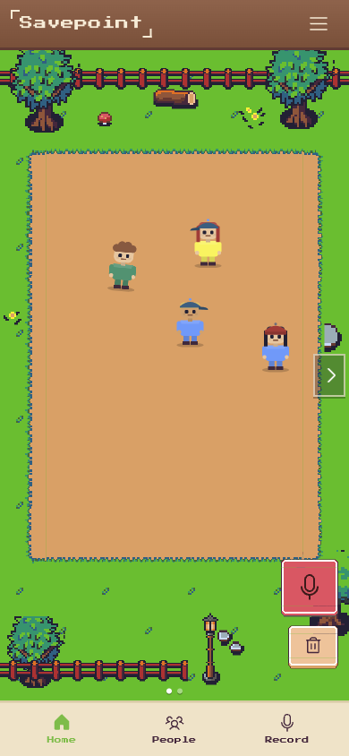
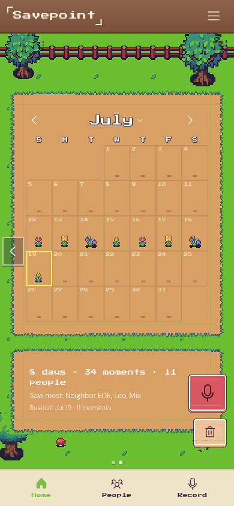
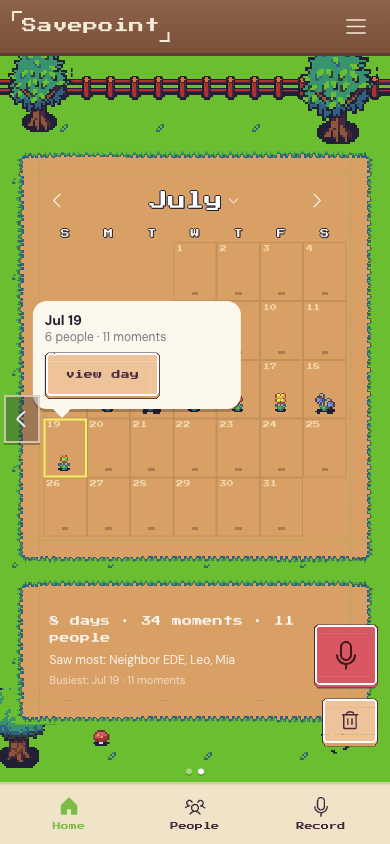
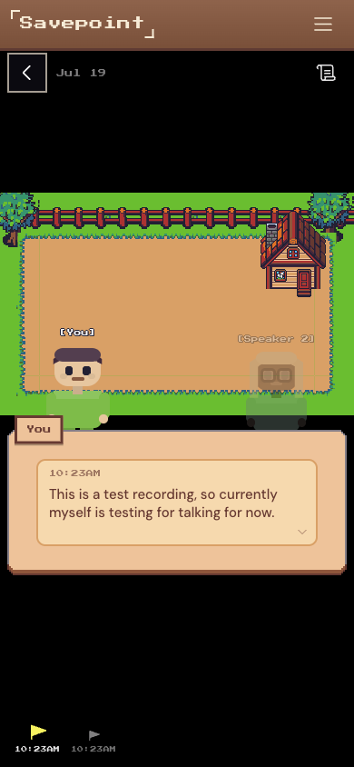
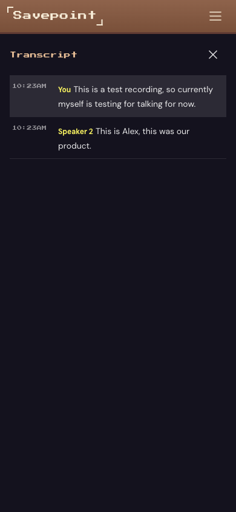
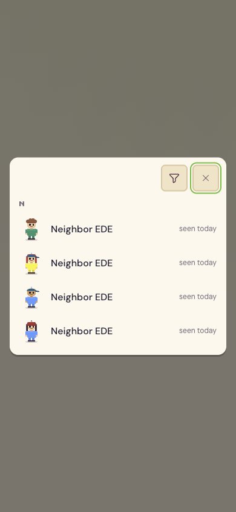
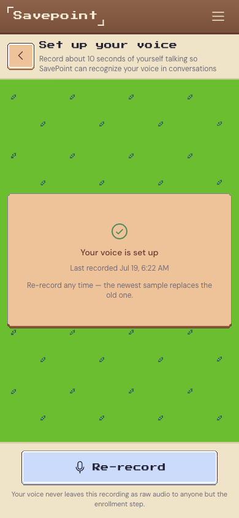
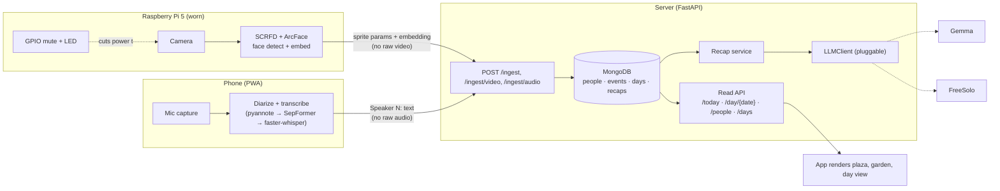
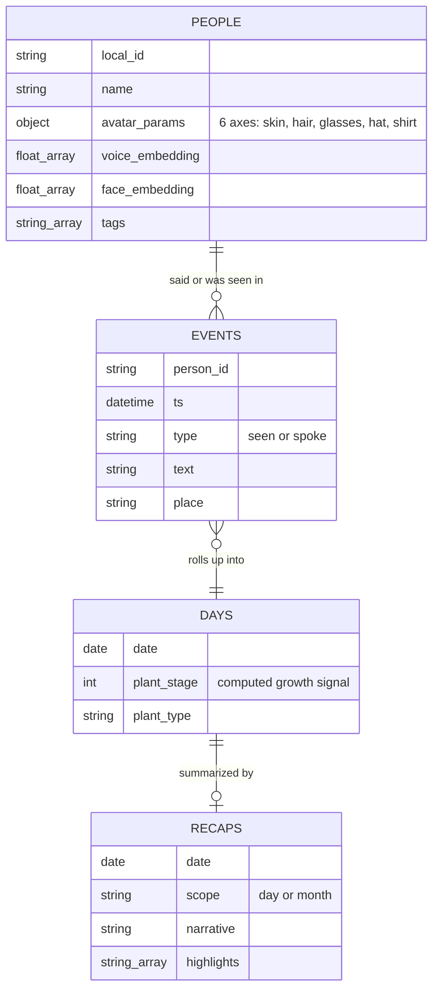

# SavePoint

> **Your life autosaves.**

<p align="center">
  
</p>

[](https://github.com/AlexZihaoXu/ht6-savepoint/actions/workflows/ci-frontend.yml)
[](https://github.com/AlexZihaoXu/ht6-savepoint/actions/workflows/ci-backend.yml)
[](https://github.com/AlexZihaoXu/ht6-savepoint/actions/workflows/ci-edge.yml)
[](https://github.com/AlexZihaoXu/ht6-savepoint/actions/workflows/ci-pipeline.yml)

## Why this exists

You've had this moment: someone waves, you smile back, and you have no idea who they are. Awkward, forgettable, you move on.

Now picture a parent living that moment every day, except it never moves on. The person who once knew your school schedule and the exact way you take your coffee starts asking the same question twice in one conversation. Starts pausing before your name, just slightly, just long enough for you to feel it. For people living with short-term memory conditions, that isn't occasional. It's constant, and they fight it the only way they can: notebooks by the bed, notebooks in the car, a name and a conversation and a promise scrawled on every page they can't afford to lose. Eventually the notebooks take over the house, and because no house holds every page forever, some of them get thrown away. Not clutter. Actual days of someone's life.

SavePoint is a small hardware-plus-software attempt at a kinder version of that notebook. A Raspberry Pi 5 worn around the neck sees the people you talk to; your phone hears the conversation. Together they turn each person into a deterministic pixel character, each day into a plant in a garden, and each conversation into dialogue boxes you can replay later. It's built game-first on purpose: the hook is charm, not therapy, so it's something you'd actually want to open every evening, and a gentle memory aid falls out of that as a side effect.

## What it does

Talk to someone at a party, a conference, a family dinner. Within a few seconds they show up on screen as their own sprite, and their words attach to them, journaled and time-stamped. At the end of the day, "Today" is waiting: a cinematic scene with a scrubbable timeline, a garden that grew one more plant, and a short recap of who you saw and what you talked about.

| Screen | What you're looking at |
| --- | --- |
|  | **Plaza**: everyone you've met, idle-wandering a shared town square. Tap a character to rename them or open their profile. |
|  | **Garden**: one calendar tile per day, planted with whatever grew out of who you saw and how the day went. |
|  | **Day peek**: tap a planted day for a one-line summary before committing to the full scene. |
|  | **Day view**: an Undertale-style cutscene, the people you talked to, in the place you talked to them, dialogue box and all. |
|  | **Transcript**: the raw diarized log behind any scene, in case the dialogue view skips ahead of what you wanted to reread. |
|  | **People**: a searchable roster of everyone SavePoint has met, filterable by tag. |
|  | **Voice setup**: a ten-second enrollment so SavePoint recognizes *you* specifically and never mistakes you for a stranger in your own recap. |

## Privacy, by construction, not by toggle

Only derived data ever leaves a device: sprite parameters, voice and face embeddings, transcript text. Never a raw photo, never raw audio. The wearable has a physical GPIO mute switch and LED wired straight to the camera, so cutting it off is a hardware fact, not a setting that a bug can silently flip back on.

## How it's built



The camera and the microphone are two independently clocked sources: the Pi never hears, the phone never sees. The server is what reconciles them, matching a face or voice to an existing person by nearest embedding and landing both streams on one shared timeline by timestamp. If the alignment ever drifts on stage, tap-to-assign lets you manually bind a `Speaker N` label to a person after the fact.

Four collections carry the whole product, not as a side effect of using MongoDB but because the schema *is* the game world:



Recaps and bios run through one pluggable `LLMClient`, swapped by a single config value. It's live today on a self-hosted Gemma endpoint, with a second backend, a small model fine-tuned on this exact recap task through FreeSolo Flash, fully wired and ready behind the same switch. Gemini and Backboard slot into the same interface without touching a call site.

Building an edge device you can't always have plugged in meant hardware couldn't be allowed to block anyone. Every capture backend sits behind a hardware abstraction layer with a fully simulated backend that runs in CI, so the whole pipeline got built and tested with zero real hardware in the loop, and the real linux/picamera2/onnxruntime backend only had to slot in once the Pi was actually free.

## Monorepo layout

| Path | What lives here |
| --- | --- |
| `app/` | React 19 + TypeScript + HeroUI v3 + Tailwind v4 (Vite), the PWA |
| `server/` | FastAPI + MongoDB (Motor), ingest, read API, recaps |
| `pipeline/` | Diarization → overlap-split → transcription, vendored and CI-safe |
| `edge/` | Pi 5 capture: camera, face detect, GPIO mute + LED |
| `design/` | Shared HeroUI theme tokens |
| `docs/` | Developer runbooks, the demo script, and this project's [GitHub Pages site](https://alexzihaoxu.github.io/ht6-savepoint/) |

Each subproject has its own toolchain and path-filtered CI; there's no root package manager, so `cd` into a subproject before running anything.

## Quickstart

Requirements: **Node 20+** (with [pnpm](https://pnpm.io/)) for the app, **Python 3.11+** with [uv](https://docs.astral.sh/uv/) for the server and pipeline.

```bash
# App (PWA dev server)
cd app
pnpm install
pnpm dev --host 0.0.0.0    # Vite, reachable on the tailnet

# Server (FastAPI dev server)
cd server
uv sync
uv run uvicorn savepoint_server.main:app --reload --host 0.0.0.0 --port 8000
```

Dev services bind to `0.0.0.0` so a teammate or a phone can reach them over the tailnet or a `cloudflared` tunnel. See [`docs/DEV.md`](./docs/DEV.md) for the full runbook and [`docs/DEPLOY.md`](./docs/DEPLOY.md) for how the whole stack, Pi included, comes up for a live demo.

## Further reading

- [`DESIGN.md`](./DESIGN.md): full architecture, speech pipeline, data model, UI spec
- [`PLAN.md`](./PLAN.md): workstreams, milestones, and the risk register
- [`docs/PIXELLAB.md`](./docs/PIXELLAB.md): the AI sprite-generation pipeline behind each character
- [`docs/demo/`](./docs/demo/): the live demo script and per-track submission writeups

## Built with

Python · TypeScript · React · FastAPI · Pydantic · MongoDB · Motor · uv · HeroUI · Tailwind CSS · Framer Motion · PWA · Raspberry Pi · picamera2 · gpiozero · ONNX Runtime · OpenCV · Gemma · Gemini · FreeSolo · Backboard

## Team

Built at Hack the 6ix 2026 by [Imperial Koi](https://devpost.com/ImperialKoi), [Victoria Y](https://devpost.com/waterprisem), [Alex Xu](https://devpost.com/alex-zihao-xu), and [Jiucheng Zang](https://devpost.com/zixuliu).

See the full [Devpost submission](https://devpost.com/software/savepoint) for the inspiration story and prize-track writeups.

---

*Hack the 6ix 2026 · Team SavePoint*
